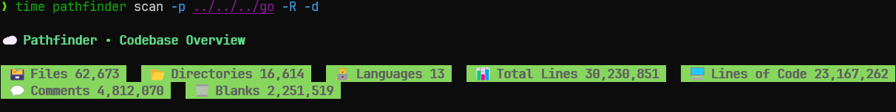

# pathfinder
Blazingly fast, lightweight CLI to map & track your codebase.

### Overview

`pathfinder` is a command-line tool written in Go that scans a specified directory (and its subdirectories) to count the number of files, directories, and total lines of code.

It is designed to be fast and efficient, leveraging Go's concurrency features to process files in parallel.

It also has a library API that you can use to integrate its functionality into your own Go applications.

### Installation

**As a CLI Tool:**
```bash
go install github.com/andrearcaina/pathfinder@latest
```

**As a Go Library:**
```bash
go get github.com/andrearcaina/pathfinder/pkg/pathfinder
````

### Go Example Usage using API
Here is a simple [example](https://github.com/andrearcaina/pathfinder/blob/main/examples/main.go) of how to use pathfinder as a library in your Go code. For more information, check out the [examples](examples/) folder or the [documentation](docs/) folder.


### CLI Usage

Below I ran `pathfinder` on this codebase with the `-R` flag to recursively scan all subdirectories, as well as the `-d` flag to scan dependencies. Image was taken at 2025-12-08 7:25 PM EST.


Then I ran the same command, but instead on my installed Go libraries and packages in WSL to benchmark performance. Image was taken at 2025-12-08 7:23 PM EST.


You can see that it found **62,673** files, **16,614** directories, and **30,230,851** total lines.

```bash
> time pathfinder -p ../../../go/ -R -d

# time output (as of 2025-12-08 7:23 PM EST)
pathfinder scan -p ../../../go -R -d  4.23s user 6.04s system 228% cpu 4.504 total
``` 
This only took 4.504 seconds (on my machine), utilizing 228% of the CPU. 
This is because `pathfinder` uses goroutines for both concurrent file reading and line counting, and parallelizes work across multiple CPU cores.

I then ran it again on the same directory:
```bash
> time pathfinder ../../../go/ -R -d

...

# time output (as of 2025-12-08 7:23 PM EST)
pathfinder scan -p ../../../go -R -d  3.19s user 2.08s system 553% cpu 0.952 total
```
This time it took only 0.952 seconds to run, utilizing 553% of the CPU.
The second run is much faster because the OS caches file data in memory, 
reducing I/O overhead and allowing goroutines to utilize more cores efficiently.
