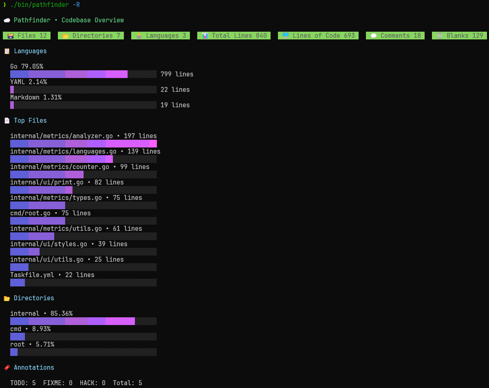

# pathfinder
Blazingly fast, lightweight CLI to map & track your codebase.

### Examples

Below I ran `pathfinder` on this codebase with the `-R` flag to recursively scan all subdirectories.  


Then I ran the same command, but instead on my installed Go libraries and packages in WSL to benchmark performance:
```bash
> time ./bin/pathfinder ../../../go/ -R

...

# time output
./bin/pathfinder -p ../../../go/ -R  6.21s user 8.83s system 281% cpu 5.337 total
```
You can see that it takes a total of 5.337 seconds to run on my machine, utilizing 281% of the CPU.
The CLI uses multiple cores via goroutines, which is why the CPU usage exceeds 100%.

I then ran it again on the same directory:
```bash
> time ./bin/pathfinder ../../../go/ -R

...

# time output
./bin/pathfinder -p ../../../go/ -R  5.08s user 3.51s system 665% cpu 1.292 total
```
This time it took only 1.292 seconds to run, utilizing 665% of the CPU.
The second run is much faster because the OS caches file data in memory, reducing I/O overhead and allowing goroutines to utilize more cores efficiently.