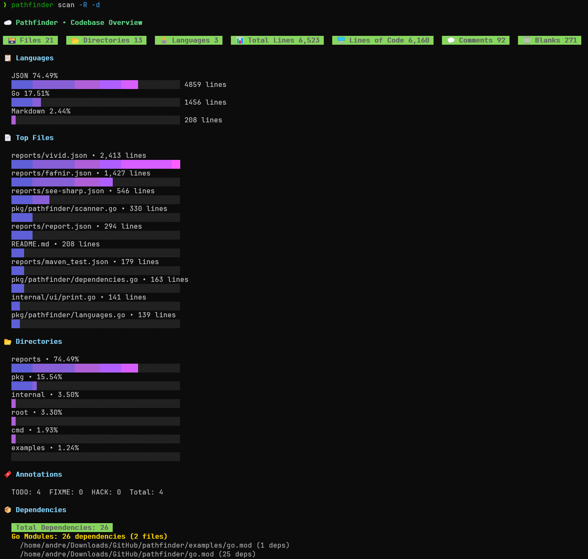

# pathfinder
Blazingly fast, lightweight CLI to map & track your codebase.

### Overview

`pathfinder` is a command-line tool written in Go that scans a specified directory (and its subdirectories) to count the number of files, directories, and total lines of code.

It is designed to be fast and efficient, leveraging Go's concurrency features to process files in parallel.

It also has a library API that you can use to integrate its functionality into your own Go applications.

### Installation

Make sure you have [Go](https://go.dev/dl/) installed (haven't tested with older versions, but Go 1.22+ is recommended). This project was built and tested with Go 1.24.5 (check go.mod file).

**As a CLI Tool:**
```bash
go install github.com/andrearcaina/pathfinder@latest
```
For more information, check out **CLI Usage** below or run `pathfinder -h` or `pathfinder scan -h` after installation.

**As a Go Library:**
```bash
go get github.com/andrearcaina/pathfinder/pkg/pathfinder
````

### Go Example Usage using API
Here is a simple [example](https://github.com/andrearcaina/pathfinder/blob/main/examples/main.go) of how to use pathfinder as a library in your Go code. For more information, check out the [examples](examples/) folder or the [documentation](docs/) folder.


### CLI Usage

Below I ran `pathfinder` on this codebase with the `-R` flag to recursively scan all subdirectories, as well as the `-d` flag to scan dependencies. Image was taken at 2025-12-08 7:25 PM EST.


Then I ran the same command, but instead on my installed Go libraries and packages in WSL to benchmark performance with the `-t` flag to enable throughput mode.

```bash
> pathfinder scan -p ../../../go -R -d -t

# throughput mode (as of 2025-12-10 12:51 PM EST)

Pathfinder • Throughput Mode

[Worker 0] processed 2823 files in 3.01s (937.7 files/sec)
[Worker 1] processed 2973 files in 3.01s (987.6 files/sec)
[Worker 2] processed 2845 files in 3.01s (945.1 files/sec)
[Worker 3] processed 2794 files in 3.01s (928.2 files/sec)
[Worker 4] processed 2874 files in 3.01s (954.7 files/sec)
[Worker 5] processed 2891 files in 3.03s (954.0 files/sec)
[Worker 6] processed 2813 files in 3.03s (928.0 files/sec)
[Worker 7] processed 2932 files in 3.01s (974.1 files/sec)
[Worker 8] processed 2888 files in 3.01s (958.2 files/sec)
[Worker 9] processed 2956 files in 3.01s (982.0 files/sec)
[Worker 10] processed 2952 files in 3.01s (980.7 files/sec)
[Worker 11] processed 2955 files in 3.01s (981.6 files/sec)
[Worker 12] processed 2899 files in 3.01s (963.0 files/sec)
[Worker 13] processed 2851 files in 3.01s (947.1 files/sec)
[Worker 14] processed 2946 files in 3.01s (978.7 files/sec)
[Worker 15] processed 2829 files in 3.01s (939.8 files/sec)

Total workers: 16
Total scanned files: 46,221
Total scanned dirs: 11,165
Total lines: 24,873,896
Total time taken: 3.03s
Overall throughput: 15229.7 files/sec
``` 

You can see that it found **46,221** files, **11,165** directories, and **24,873,896** total lines (as of 2025-12-10 12:51 PM EST).

Similarly, I ran with the `time` command to compare time taken and CPU usage (without throughput mode):

```bash
> time pathfinder scan -p ../../../go -R -d

...

pathfinder scan -p ../../../go -R -d  3.17s user 4.77s system 251% cpu 3.154 total
```

This only took 3.03-3.154 seconds (on my machine), utilizing 251% of the CPU. 
This is because `pathfinder` uses goroutines for both concurrent file reading and line counting, and parallelizes work across multiple CPU cores.

I then ran it again on the same directory:
```bash
> pathfinder scan -p ../../../go -R -d -t
Pathfinder • Throughput Mode

[Worker 0] processed 2741 files in 0.61s (4516.0 files/sec)
[Worker 1] processed 2963 files in 0.61s (4892.2 files/sec)
[Worker 2] processed 2800 files in 0.63s (4475.3 files/sec)
[Worker 3] processed 2924 files in 0.61s (4820.4 files/sec)
[Worker 4] processed 2903 files in 0.61s (4754.6 files/sec)
[Worker 5] processed 2967 files in 0.62s (4808.5 files/sec)
[Worker 6] processed 2722 files in 0.63s (4342.5 files/sec)
[Worker 7] processed 3079 files in 0.61s (5083.9 files/sec)
[Worker 8] processed 2881 files in 0.61s (4736.4 files/sec)
[Worker 9] processed 3219 files in 0.62s (5206.3 files/sec)
[Worker 10] processed 2708 files in 0.62s (4380.7 files/sec)
[Worker 11] processed 2767 files in 0.61s (4525.5 files/sec)
[Worker 12] processed 2610 files in 0.63s (4147.0 files/sec)
[Worker 13] processed 2840 files in 0.61s (4668.4 files/sec)
[Worker 14] processed 3009 files in 0.62s (4851.4 files/sec)
[Worker 15] processed 3088 files in 0.62s (5010.2 files/sec)

Total workers: 16
Total scanned files: 46,221
Total scanned dirs: 11,165
Total lines: 24,873,896
Total time taken: 0.63s
Overall throughput: 73029.2 files/sec

# and

> time pathfinder scan -p ../../../go -R -d

...

pathfinder scan -p ../../../go -R -d  2.71s user 1.63s system 634% cpu 0.684 total
```
This time it took only 0.63-0.684 seconds to run, utilizing 634% of the CPU.
The second run is much faster because the OS caches file data in memory, 
reducing I/O overhead and allowing goroutines to utilize more cores efficiently.
