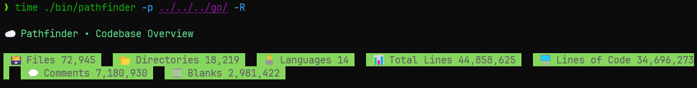

# pathfinder
Blazingly fast, lightweight CLI to map & track your codebase.

### Examples

Below I ran `pathfinder` on this codebase with the `-R` flag to recursively scan all subdirectories.  


Then I ran the same command, but instead on my installed Go libraries and packages in WSL to benchmark performance:


You can see that it found **72,945** files, **18,219** directories, and **44,858,625** total lines.

```bash
# time output
./bin/pathfinder -p ../../../go/ -R  6.18s user 7.88s system 279% cpu 5.028 total
``` 
This only took 5.028 seconds (on my machine), utilizing 279% of the CPU. 
This is because `pathfinder` uses goroutines for concurrent file reading and processing.

I then ran it again on the same directory:
```bash
> time ./bin/pathfinder ../../../go/ -R

...

# time output
./bin/pathfinder -p ../../../go/ -R  5.08s user 3.51s system 665% cpu 1.292 total
```
This time it took only 1.292 seconds to run, utilizing 665% of the CPU.
The second run is much faster because the OS caches file data in memory, 
reducing I/O overhead and allowing goroutines to utilize more cores efficiently.