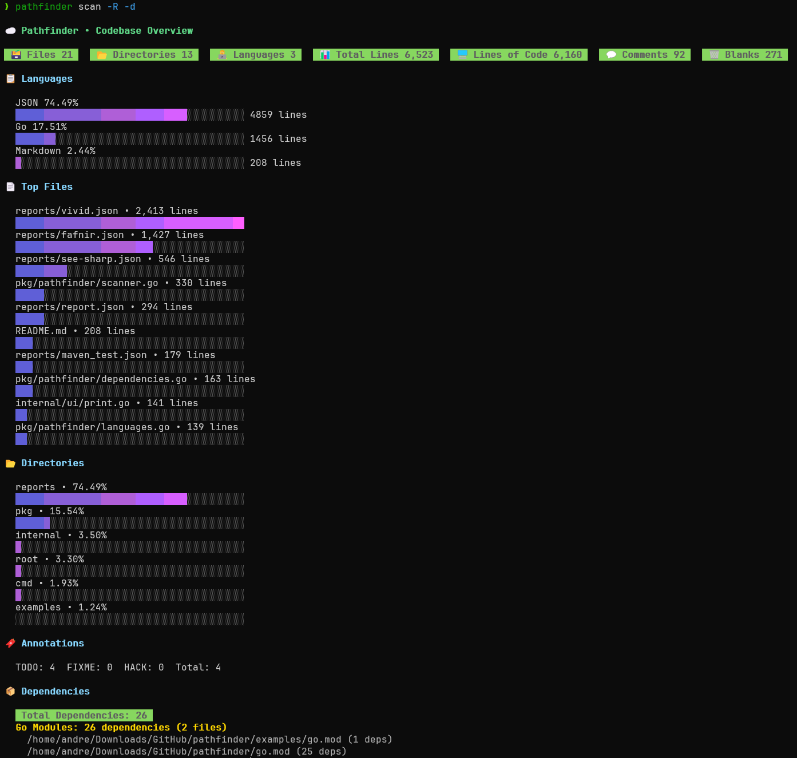
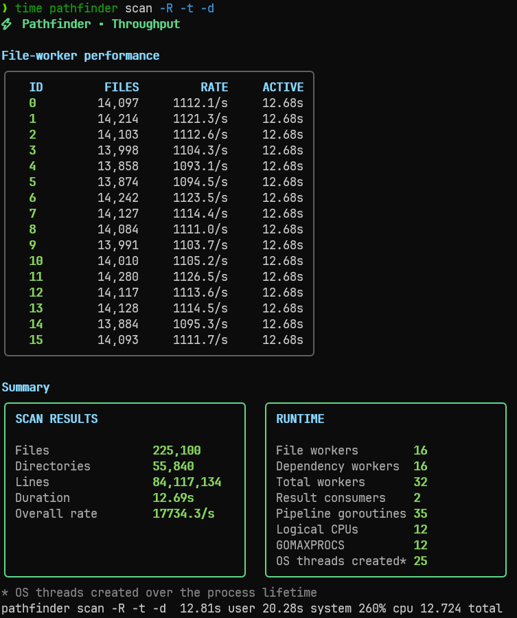
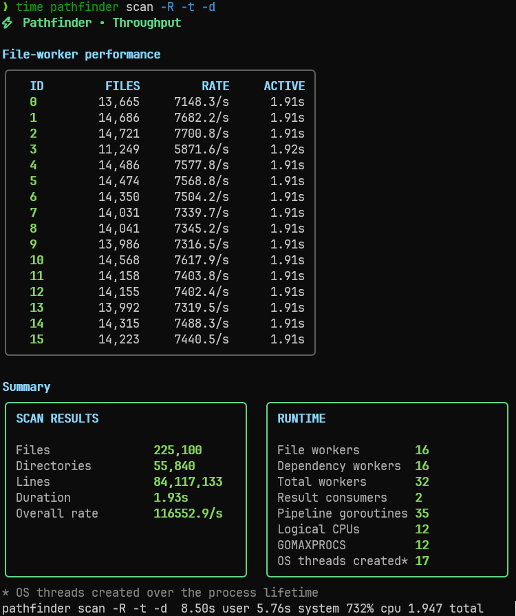

# pathfinder

[](https://goreportcard.com/report/github.com/andrearcaina/pathfinder)
[](https://github.com/andrearcaina/pathfinder/actions/workflows/pathfinder-ci.yml)
[](https://github.com/andrearcaina/pathfinder/actions/workflows/pathfinder-cd.yml)

Blazingly fast, lightweight CLI to map & track your codebase.

### Overview

`pathfinder` is a command-line tool written in Go that scans a specified directory (and its subdirectories) to count the number of files, directories, and total lines of code.

It is designed to be fast and efficient, leveraging Go's concurrency features to process files in parallel.

It is also implemented as a Go package, so that you can use to integrate its functionality into your own Go applications/programs.

### Installation

`pathfinder` can be installed and used in two main ways:

**As a CLI Tool**

Install via cURL on Linux, WSL, or Git Bash:

```bash
curl -fsSL https://raw.githubusercontent.com/andrearcaina/pathfinder/main/install.sh | sh
```

Install via Powershell on Windows:

```bash
irm https://raw.githubusercontent.com/andrearcaina/pathfinder/main/install.ps1 | iex
```

Or via Go (requires Go 1.24.5 or later):

```bash
go install github.com/andrearcaina/pathfinder@latest
```

**As a Package**

Install via Go (requires Go 1.24.5 or later):

```bash
go get github.com/andrearcaina/pathfinder/pkg/pathfinder
```

### Documentation

For detailed documentation on how to use `pathfinder`, both as a CLI tool and as a Go library, please refer to the [docs](docs/) folder in the repository and check their respective files (`cli.md` and `api.md`). You can also check out the Godoc page [here](https://pkg.go.dev/github.com/andrearcaina/pathfinder/pkg/pathfinder). The architecture and designs is also documented in the `architecture.md` file and [designs](docs/designs) folder.

### Go Example Usage using API

Here's a simple example of how to use the `pathfinder` library in your Go code:

```go
package main

import (
	"fmt"

	"github.com/andrearcaina/pathfinder/pkg/pathfinder"
)

func main() {
	 // default config (scans current directory and non-recursively)
	report, err := pathfinder.Scan(pathfinder.Config{})
	if err != nil {
		fmt.Printf("Failed to scan codebase: %v", err)
	}

	fmt.Printf("Scanned %d files in %d directories with a total of %d lines\n",
		report.CodebaseMetrics.TotalFiles,
		report.CodebaseMetrics.TotalDirs,
		report.CodebaseMetrics.TotalLines,
	)
}
```

### CLI Usage

Below I ran `pathfinder` on this codebase with the `-R` flag to recursively scan all subdirectories, as well as the `-d` flag to scan dependencies. Image was taken at 2025-12-08 7:25 PM EST.


Then I ran the same command, but instead on my home directory (`$HOME`) in WSL with `time` as well to benchmark performance with the `-t` flag to enable throughput mode.



You can see that it found **225,100** files, **55,840** directories, and **84,117,199** total lines (Image taken as of 2026-08-06 2:28 PM ET).

Although the scan completed in 12.69-12.724 seconds, it was slower than subsequent runs because much of the filesystem data had not yet
been cached by the operating system. I then ran the same command again against the same directory right after:



This time it took only 1.93-1.947 seconds to run, utilizing 732% of the CPU.
The second run is much faster because the OS caches file data in memory,
reducing I/O overhead and allowing goroutines to utilize more cores efficiently.

The `pathfinder` CLI also has a flag that exports the codebase metric data as a JSON file. Check out [examples/json-exports/](examples/json-exports/) directory to see example JSON reports generated.
