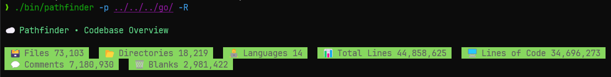

# pathfinder
Blazingly fast, lightweight CLI to map & track your codebase.

### Examples

Below I ran `pathfinder` on this codebase with the `-R` flag to recursively scan all subdirectories. Image was taken at 2025-08-30 3:08 PM EST.


Then I ran the same command, but instead on my installed Go libraries and packages in WSL to benchmark performance.  Image was taken at 2025-08-30 3:08 PM EST.


You can see that it found **73,103** files, **18,219** directories, and **44,858,625** total lines.

```bash
> time ./bin/pathfinder ../../../go/ -R

# time output (as of 2025-08-30 3:08 PM EST)
./bin/pathfinder -p ../../../go/ -R  5.88s user 8.15s system 281% cpu 4.995 total
``` 
This only took 4.995 seconds (on my machine), utilizing 281% of the CPU. 
This is because `pathfinder` uses goroutines for concurrent file reading and processing.

I then ran it again on the same directory:
```bash
> time ./bin/pathfinder ../../../go/ -R

...

# time output (as of 2025-08-30 3:08 PM EST)
./bin/pathfinder -p ../../../go/ -R  4.69s user 2.97s system 686% cpu 1.117 total
```
This time it took only 1.117 seconds to run, utilizing 665% of the CPU.
The second run is much faster because the OS caches file data in memory, 
reducing I/O overhead and allowing goroutines to utilize more cores efficiently.