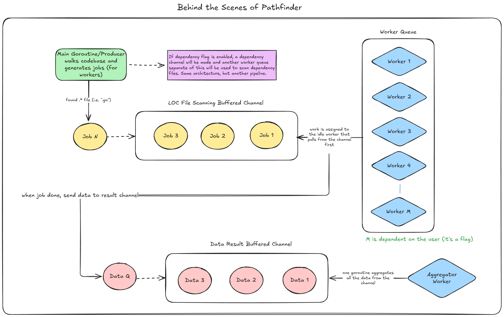

# Architecture
### Overview
This document provides an overview of how the overall architecture, design, and flow of Pathfinder. 

### Concurrency Model

Pathfinder uses a concurrent architecture designed to achieve high-performance parallelism. The architecture follows a Worker Pool Pattern. A single Producer (the main goroutine) scans the directory tree and dispatches tasks to a buffered file scanning channel (and a dependency scanning channel if enabled). A pool of Workers (goroutines) consumes these tasks, processing files (and dependencies) in parallel across available CPU cores, and sends the data to a Results Channel. Finally, dedicated Consumer goroutines aggregate these results into the final report.

The diagram below visualizes how Pathfinder utilizes concurrency and parallelism to efficiently scan and process data.

