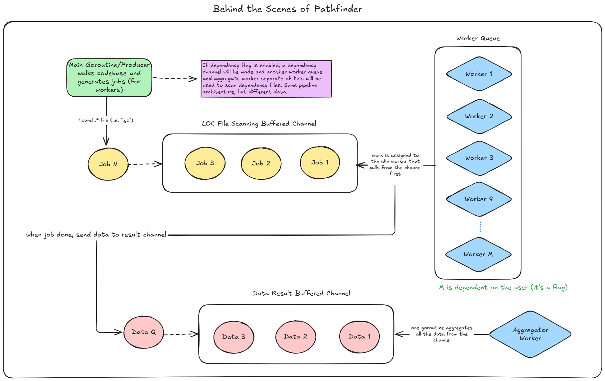

# Architecture

### Overview

This document provides an overview of how the overall architecture, design, and flow of Pathfinder.

### Concurrency Model

Pathfinder uses a concurrent architecture designed for high-performance parallel processing. It follows the Worker Pool and Fan-In patterns: a single producer in the main goroutine scans the directory tree and sends tasks to a buffered file-scanning channel, as well as a dependency-scanning channel when enabled. Worker goroutines process these tasks concurrently across available CPU cores and send their output to result channels, where dedicated consumer goroutines aggregate it into the final report.

The diagram below visualizes how Pathfinder utilizes concurrency and parallelism to efficiently scan and process data.


### Simplified Model

This is a simplified view of how Pathfinder processes files.

```plaintext
directory walker (main goroutine/producer)
         │
         V
    job channel (file or dependency)
         │
         ├────> worker 1 ────┐
         ├────> worker 2 ────┼────> result channel
         └────> worker N ────┘              │
                                            V
                                       aggregator goroutine
```
